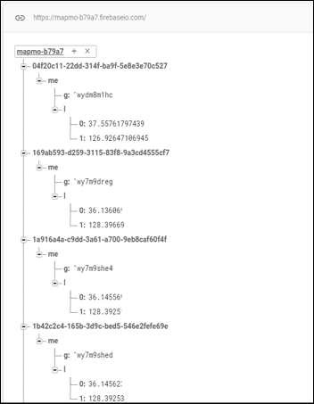
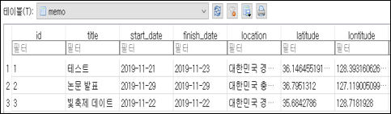
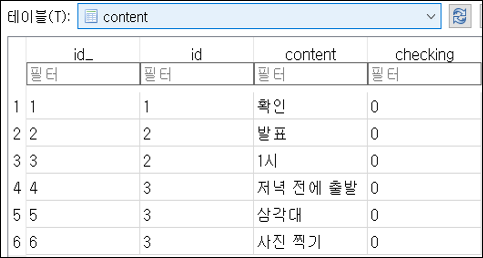
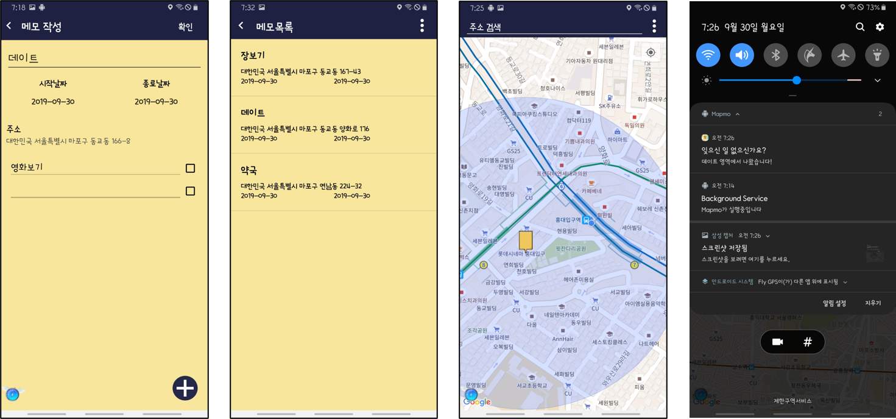

# Mapmo (스마트서울 모바일앱 공모전)

## 프로젝트 계획이유

영업 및 출장이 많은 요즘 직장인들에게 일정에 대한 알림이 시간만으로 부족할수도 있겠다고 생각했습니다. 그래서 사용자가 지도의 위치 좌표를 통해 메모를 작성하고, 메모의 위치 좌표에 특정 거리 이내로 접근했을 때와 특정 거리 이상 벗어났을 때 푸시 메시지를 보내 해당 위치에서 해야할 일을 상기시킬 수 있는 어플리케이션을 계획했습니다.

## 동작 방식

사용자가 구글 맵 API를 이용한 맵에 메모를 작성하면 메모 위치의 지오펜스 범위와 사용자의 위치를 firebase realtime db를 통해 실시간 연산합니다. 사용자가 지오펜스 범위를 벗어나거나 접근할 때 fcm 푸시메시지를 통해 알림을 제공합니다.

## Database
### Firebase Realtime database

 
### SQLite database

 

 
## Screenshot

 
## 기대 효과
* 치매 또는 건망증 증상을 앓고 있는 사람들에게 기존의 메모 알림보다 효과적인 해결책이 될 수 있습니다.
* 바쁜 현대인의 외부 업무 스케줄러로 활용될 수 있습니다.
* 관광지의 스탬프 역할로 사용되어 관광산업의 증진을 기대할 수 있다.
## Built With
* [tkdals2317](https://github.com/tkdals2317)
